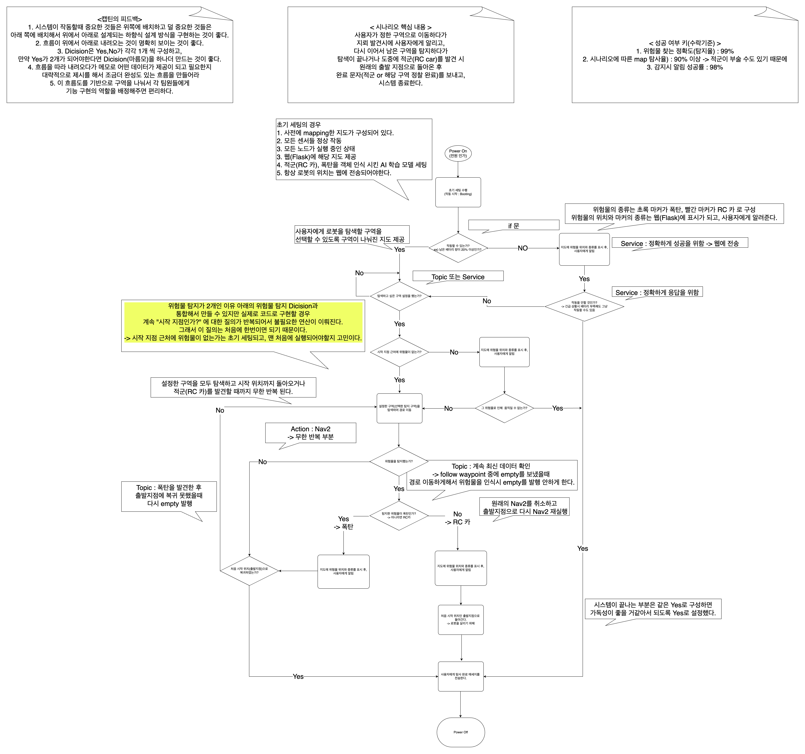

# Argus: 건물 내부 위험물 탐지 로봇

### 프로젝트 개요
- **목적**: 로봇 1대가 건물 내부를 탐색하며 위험물(예: 크레어 모어)과 적군(RC Car)을 탐지  
- **영상 링크**: <br> [](https://youtu.be/rrv0ZHoh6SU)  <br>
  ➡ 영상 클릭 시, YouTube 재생

<br>

## 🔧 주요 기능
1. **예측 지점 정밀 탐색**: 위험물이 있을 것으로 예상되는 지점에서 360도 회전하며 정밀 탐색 수행  
2. **위험물 마커 표시**: 위험물 탐지 시 지도 상에 마커로 표시  
3. **적군 위치 기록 및 회귀**: 적군(RC Car) 감지 시, 로봇이 시작 지점으로 돌아가며 탐지 위치를 마커로 표시  

<br>

## 🚀 실행 흐름도


<br>

## 🚀 실행 코드
```bash
# 경로 추종 및 탐색
ros2 run argus argus_follow_waypoints.py

# YOLOv8 기반 위험물 탐지
ros2 run yolo_detect yolov8_obj_det_wc.py
